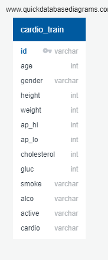
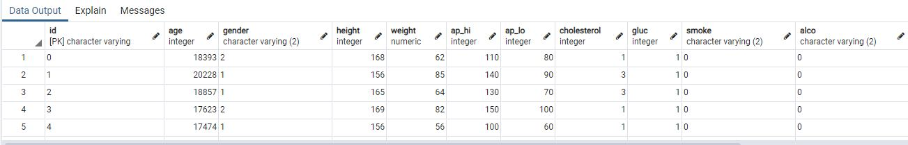

# Technologies Used
## Data Cleaning and Analysis
Pandas to convert data into a dataframe for data preprocessing and transformation. Additional Python modules will be added for statistical analysis, machine learning processing, etc.

## Database Storage
Postgres SQL - PG Admin is the database storage for the raw and cleaned data. For our given dataset we have one table to reference therefore our ERD is a simple table with assigned data types. For deliverable week 1 we have imported our actual dataset and no sample data was used.  

## Machine Learning
SciKitLearn is the ML library we'll be using to create a classifier. We'll standardize our data using StandardScaler, set up our training and testing dataset using train_test_split from sklearn.model_selection. RandomForest Classifier will be used to enhance the model performance and accuracy. Carry out a few correlation studies on various data points, use Random Forest, without PCA, but then do PCA and repeat and compare the results.

## Dashboard
We will use a D3.js template to display a dashboard via Flask. It will be hosted on HTML, CSS, and Javascript.
